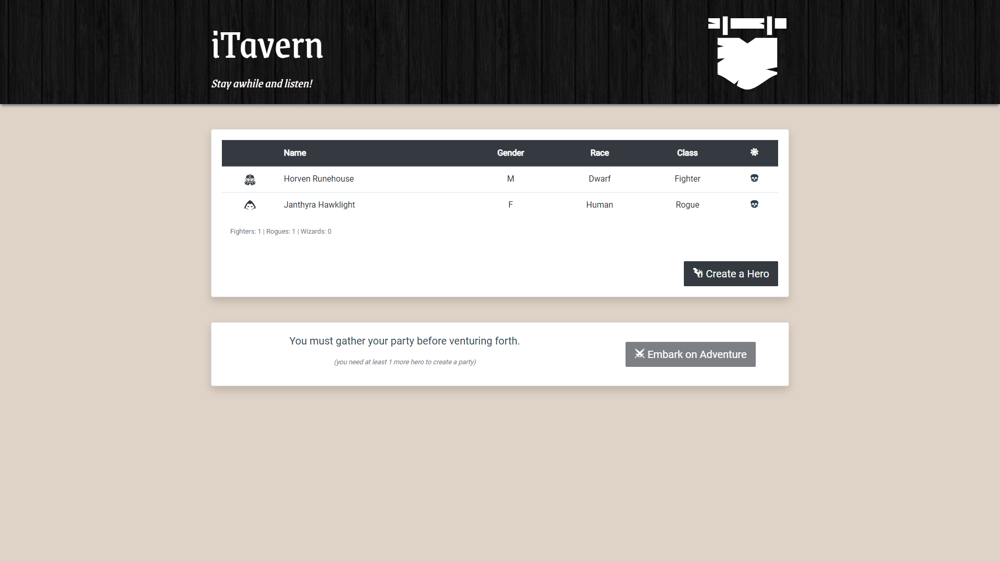

# iTavern

Sample application prepared for Vue workshop.



## Requirements

- Node.js in version 8.9 or above
- Chrome or Firefox browser

## Setup

1. Download empty application from repository:

   ```
   git clone git@github.com:rrozanski/i-tavern.git
   ```
   or
   ```
   git clone https://github.com/rrozanski/i-tavern.git
   ```
2. Install dependencies:

   ```
   npm install
   ```
3. Run application:

   ```
   npm run serve
   ```
4. Open browser on url:

   ```
   http://localhost:8080/
   ```

## Useful tools

- Suggested IDEs:
   - WebStorm
   - Visual Studio Code (with Vetur extension)

- Vue Devtools extension: [https://github.com/vuejs/vue-devtools](https://github.com/vuejs/vue-devtools)

## Source code of specific steps of the workshop

Commits of specific steps are on the branch:
```
completed-app
```

## Example data for the hero list

```
[
    {
        id: 1,
        name: 'Horven Runehouse',
        gender: Gender.Male,
        race: Race.Dwarf,
        class: HeroClass.Fighter,
        abilities: {
            dexterity: 10,
            strength: 20,
            wisdom: 0
        }
    },
    {
        id: 2,
        name: 'Janthyra Hawklight',
        gender: Gender.Female,
        race: Race.Human,
        class: HeroClass.Rogue,
        abilities: {
            dexterity: 20,
            strength: 10,
            wisdom: 5
        }
    },
    {
        id: 3,
        name: 'Shaster Dragonsoultouched',
        gender: Gender.Male,
        race: Race.Elf,
        class: HeroClass.Wizard,
        abilities: {
            dexterity: 5,
            strength: 2,
            wisdom: 20
        }
    }
]
```

## Used assets
- Google Fonts:
  - Roboto: [https://fonts.google.com/specimen/Roboto](https://fonts.google.com/specimen/Roboto)
  - Grenze: [https://fonts.google.com/specimen/Grenze](https://fonts.google.com/specimen/Grenze)
- dark wood texture by Omar Alvarado: [https://www.toptal.com/designers/subtlepatterns/dark-wood/](https://www.toptal.com/designers/subtlepatterns/dark-wood/)
- RPG-Awesome icons: [http://nagoshiashumari.github.io/Rpg-Awesome/](http://nagoshiashumari.github.io/Rpg-Awesome/)
- SVG images:
  - hanging sign icon by Delapouite: [https://game-icons.net/1x1/delapouite/hanging-sign.html](https://game-icons.net/1x1/delapouite/hanging-sign.html)
  - dwarf helmet icon by Kier Heyl: [https://game-icons.net/1x1/kier-heyl/dwarf-helmet.html](https://game-icons.net/1x1/kier-heyl/dwarf-helmet.html)
  - hood icon by Lorc: [https://game-icons.net/1x1/lorc/hood.html](https://game-icons.net/1x1/lorc/hood.html)
  - wizard face icon by Delapouite: [https://game-icons.net/1x1/delapouite/wizard-face.html](https://game-icons.net/1x1/delapouite/wizard-face.html)
  - wizard face icon by Delapouite: [https://game-icons.net/1x1/delapouite/wizard-face.html](https://game-icons.net/1x1/delapouite/wizard-face.html)
  - spiked dragon head icon by Delapouite: [https://game-icons.net/1x1/delapouite/spiked-dragon-head.html](https://game-icons.net/1x1/delapouite/spiked-dragon-head.html)
